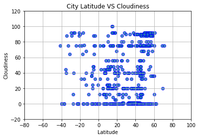
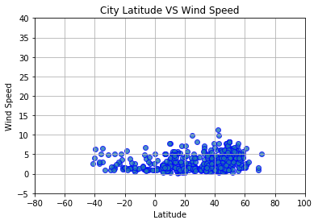

# API
# Trend 1-:
The Maximum temperature depends on the latitude of the city as we see a symmetry in the plots for temperature as we go through the latitude.

# Trend 2-:
Cloudiness does not depend on the latitude. The plot indicates diversity in cloudiness as we go through the latitudes.

# Trend 3-:
As the latitude increases wind speed also get increased. We can see bubbles more crowded as the latitude increases.


```python
# Dependencies
import datetime
import matplotlib.pyplot as plt
import pandas as pd
from matplotlib.dates import DateFormatter
import requests
import random
from citipy import citipy
import json
```


```python
# create the URL path
url="https://api.openweathermap.org/data/2.5/weather"
#read api key from file and store. Assuming that the api_key exists in the file has api_key in json format
file = open("my_api_key.json", "r") 
json_data = file.read()
data = json.loads(json_data)
api_key = data["api_key"]
# create url params
params = {"appid":api_key}
#Creating a data frame with the below coloumns
columns=["City", "Latitude", "Longitude", "Cloudiness", "Humidity", "Max Temp", "Wind Speed", "Country", "Date"]
city_weather_df = pd.DataFrame(columns=columns)
```


```python
# Creating a counter (initializing with zero)which will break once we get 550cities
num_cities = 0
# get the list of cities
cities = list(citipy.WORLD_CITIES_DICT.keys())
#randomize the city list
random.shuffle(cities)
#Perform API Calls
for city in cities:
    params['lat'] = city[0]
    params['lon'] = city[1]
    req = requests.get(url, params=params)
    print("Requesting URL: " + req.url)
    location = req.json()
    try: 
        city_name = location["name"]
        Latitude=location["coord"]["lat"]
        Longitude=location["coord"]["lon"]
        Cloudiness=location["clouds"]["all"]
        Humidity=location["main"]["humidity"]
        MaxTemp=location["main"]["temp_max"]
        WindSpeed=location["wind"]["speed"]
        Country=location["sys"]["country"]
        Date=location["dt"]
        current_city_data= {
            "City":[city_name],
            "Latitude":[Latitude],
            "Longitude":[Longitude],
            "Cloudiness":[Cloudiness],
            "Humidity":[Humidity],
            "Max Temp":[MaxTemp],
            "Wind Speed":[WindSpeed],
            "Country":[Country],
            "Date":[Date]
        }
        city_weather_df = city_weather_df.append(pd.DataFrame.from_dict(current_city_data))
        num_cities += 1
        if num_cities == 550:
            break
    except KeyError:
        print("Error with city data. Skipping")
        continue
```

    Requesting URL: https://api.openweathermap.org/data/2.5/weather?appid=dfcce77b90caed738028f45ab2ea7099&lat=-26.833333&lon=-49.3
    Requesting URL: https://api.openweathermap.org/data/2.5/weather?appid=dfcce77b90caed738028f45ab2ea7099&lat=-7.733333&lon=110.366667
    Requesting URL: https://api.openweathermap.org/data/2.5/weather?appid=dfcce77b90caed738028f45ab2ea7099&lat=49.552243&lon=13.06993
    Requesting URL: https://api.openweathermap.org/data/2.5/weather?appid=dfcce77b90caed738028f45ab2ea7099&lat=44.9669444&lon=15.9430556
    Requesting URL: https://api.openweathermap.org/data/2.5/weather?appid=dfcce77b90caed738028f45ab2ea7099&lat=17.906495&lon=121.72625
    Requesting URL: https://api.openweathermap.org/data/2.5/weather?appid=dfcce77b90caed738028f45ab2ea7099&lat=26.233333&lon=90.583333
    Requesting URL: https://api.openweathermap.org/data/2.5/weather?appid=dfcce77b90caed738028f45ab2ea7099&lat=-23.383333&lon=-51.45
    Requesting URL: https://api.openweathermap.org/data/2.5/weather?appid=dfcce77b90caed738028f45ab2ea7099&lat=-11.5997222&lon=-76.1411111
    Requesting URL: https://api.openweathermap.org/data/2.5/weather?appid=dfcce77b90caed738028f45ab2ea7099&lat=7.17&lon=-73.093056
    Requesting URL: https://api.openweathermap.org/data/2.5/weather?appid=dfcce77b90caed738028f45ab2ea7099&lat=-21.9666667&lon=28.3333333
    Requesting URL: https://api.openweathermap.org/data/2.5/weather?appid=dfcce77b90caed738028f45ab2ea7099&lat=7.393333&lon=125.718889
    Requesting URL: https://api.openweathermap.org/data/2.5/weather?appid=dfcce77b90caed738028f45ab2ea7099&lat=15.333333&lon=-90.166667
    Requesting URL: https://api.openweathermap.org/data/2.5/weather?appid=dfcce77b90caed738028f45ab2ea7099&lat=-39.65&lon=176.833333
    Requesting URL: https://api.openweathermap.org/data/2.5/weather?appid=dfcce77b90caed738028f45ab2ea7099&lat=8.962778&lon=125.425833
    Requesting URL: https://api.openweathermap.org/data/2.5/weather?appid=dfcce77b90caed738028f45ab2ea7099&lat=16.571667&lon=120.324167
    Requesting URL: https://api.openweathermap.org/data/2.5/weather?appid=dfcce77b90caed738028f45ab2ea7099&lat=58.781024&lon=57.777818
    Requesting URL: https://api.openweathermap.org/data/2.5/weather?appid=dfcce77b90caed738028f45ab2ea7099&lat=17.516667&lon=-93.066667
    Requesting URL: https://api.openweathermap.org/data/2.5/weather?appid=dfcce77b90caed738028f45ab2ea7099&lat=28.116667&lon=77.016667
    Requesting URL: https://api.openweathermap.org/data/2.5/weather?appid=dfcce77b90caed738028f45ab2ea7099&lat=50.307941&lon=18.855156
    Requesting URL: https://api.openweathermap.org/data/2.5/weather?appid=dfcce77b90caed738028f45ab2ea7099&lat=9.65&lon=-9.7833333
    Requesting URL: https://api.openweathermap.org/data/2.5/weather?appid=dfcce77b90caed738028f45ab2ea7099&lat=33.883333&lon=135.15
    Requesting URL: https://api.openweathermap.org/data/2.5/weather?appid=dfcce77b90caed738028f45ab2ea7099&lat=36.736628&lon=-6.437033
    Requesting URL: https://api.openweathermap.org/data/2.5/weather?appid=dfcce77b90caed738028f45ab2ea7099&lat=22.216667&lon=-97.9
    Requesting URL: https://api.openweathermap.org/data/2.5/weather?appid=dfcce77b90caed738028f45ab2ea7099&lat=54.783333&lon=9.433333
    Requesting URL: https://api.openweathermap.org/data/2.5/weather?appid=dfcce77b90caed738028f45ab2ea7099&lat=25.483333&lon=85.95
    Requesting URL: https://api.openweathermap.org/data/2.5/weather?appid=dfcce77b90caed738028f45ab2ea7099&lat=34.583333&lon=135.616667
    Requesting URL: https://api.openweathermap.org/data/2.5/weather?appid=dfcce77b90caed738028f45ab2ea7099&lat=37.15&lon=15.033333
    Requesting URL: https://api.openweathermap.org/data/2.5/weather?appid=dfcce77b90caed738028f45ab2ea7099&lat=51.8738889&lon=-8.3444444
    Requesting URL: https://api.openweathermap.org/data/2.5/weather?appid=dfcce77b90caed738028f45ab2ea7099&lat=-27.35&lon=-55.783333
    Requesting URL: https://api.openweathermap.org/data/2.5/weather?appid=dfcce77b90caed738028f45ab2ea7099&lat=7.7899&lon=5.7117
    Requesting URL: https://api.openweathermap.org/data/2.5/weather?appid=dfcce77b90caed738028f45ab2ea7099&lat=27.7519444&lon=-98.0694444
    Requesting URL: https://api.openweathermap.org/data/2.5/weather?appid=dfcce77b90caed738028f45ab2ea7099&lat=7.806677&lon=124.168461
    Requesting URL: https://api.openweathermap.org/data/2.5/weather?appid=dfcce77b90caed738028f45ab2ea7099&lat=32.9125&lon=-96.6386111
    Requesting URL: https://api.openweathermap.org/data/2.5/weather?appid=dfcce77b90caed738028f45ab2ea7099&lat=32.994722&lon=112.532778
    Requesting URL: https://api.openweathermap.org/data/2.5/weather?appid=dfcce77b90caed738028f45ab2ea7099&lat=51.35&lon=4.766667
    Requesting URL: https://api.openweathermap.org/data/2.5/weather?appid=dfcce77b90caed738028f45ab2ea7099&lat=36.0969444&lon=-80.4194444
    Requesting URL: https://api.openweathermap.org/data/2.5/weather?appid=dfcce77b90caed738028f45ab2ea7099&lat=37.9680556&lon=23.565
    Requesting URL: https://api.openweathermap.org/data/2.5/weather?appid=dfcce77b90caed738028f45ab2ea7099&lat=15.2333333&lon=-87.85
    Requesting URL: https://api.openweathermap.org/data/2.5/weather?appid=dfcce77b90caed738028f45ab2ea7099&lat=47.233333&lon=23.05
    Requesting URL: https://api.openweathermap.org/data/2.5/weather?appid=dfcce77b90caed738028f45ab2ea7099&lat=37.1531&lon=-7.887515
    Requesting URL: https://api.openweathermap.org/data/2.5/weather?appid=dfcce77b90caed738028f45ab2ea7099&lat=47.683333&lon=16.6
    Requesting URL: https://api.openweathermap.org/data/2.5/weather?appid=dfcce77b90caed738028f45ab2ea7099&lat=56.763744&lon=60.549384
    Requesting URL: https://api.openweathermap.org/data/2.5/weather?appid=dfcce77b90caed738028f45ab2ea7099&lat=19.45&lon=-98.866667
    Requesting URL: https://api.openweathermap.org/data/2.5/weather?appid=dfcce77b90caed738028f45ab2ea7099&lat=41.5647222&lon=-87.5388889
    Requesting URL: https://api.openweathermap.org/data/2.5/weather?appid=dfcce77b90caed738028f45ab2ea7099&lat=48.841651&lon=44.557926
    Requesting URL: https://api.openweathermap.org/data/2.5/weather?appid=dfcce77b90caed738028f45ab2ea7099&lat=44.616667&lon=25.566667
    Requesting URL: https://api.openweathermap.org/data/2.5/weather?appid=dfcce77b90caed738028f45ab2ea7099&lat=20.183333&lon=-97.583333
    Requesting URL: https://api.openweathermap.org/data/2.5/weather?appid=dfcce77b90caed738028f45ab2ea7099&lat=53.0663889&lon=-8.8166667
    Requesting URL: https://api.openweathermap.org/data/2.5/weather?appid=dfcce77b90caed738028f45ab2ea7099&lat=29.533333&lon=74.833333
    Requesting URL: https://api.openweathermap.org/data/2.5/weather?appid=dfcce77b90caed738028f45ab2ea7099&lat=22.1038889&lon=-79.7216667
    Requesting URL: https://api.openweathermap.org/data/2.5/weather?appid=dfcce77b90caed738028f45ab2ea7099&lat=51.50739&lon=36.051012
    Requesting URL: https://api.openweathermap.org/data/2.5/weather?appid=dfcce77b90caed738028f45ab2ea7099&lat=22.320833&lon=88.230556
    Requesting URL: https://api.openweathermap.org/data/2.5/weather?appid=dfcce77b90caed738028f45ab2ea7099&lat=52.1&lon=9.35
    Requesting URL: https://api.openweathermap.org/data/2.5/weather?appid=dfcce77b90caed738028f45ab2ea7099&lat=41.3908333&lon=19.655
    Requesting URL: https://api.openweathermap.org/data/2.5/weather?appid=dfcce77b90caed738028f45ab2ea7099&lat=-33.035471&lon=-68.877823
    Requesting URL: https://api.openweathermap.org/data/2.5/weather?appid=dfcce77b90caed738028f45ab2ea7099&lat=55.3591667&lon=21.7022222
    Requesting URL: https://api.openweathermap.org/data/2.5/weather?appid=dfcce77b90caed738028f45ab2ea7099&lat=5.172819&lon=-72.547058
    Requesting URL: https://api.openweathermap.org/data/2.5/weather?appid=dfcce77b90caed738028f45ab2ea7099&lat=45.683333&lon=10.183333
    Requesting URL: https://api.openweathermap.org/data/2.5/weather?appid=dfcce77b90caed738028f45ab2ea7099&lat=10.4179&lon=122.887
    Requesting URL: https://api.openweathermap.org/data/2.5/weather?appid=dfcce77b90caed738028f45ab2ea7099&lat=50.866667&lon=5.183333
    Requesting URL: https://api.openweathermap.org/data/2.5/weather?appid=dfcce77b90caed738028f45ab2ea7099&lat=9.6314&lon=123.0873
    Requesting URL: https://api.openweathermap.org/data/2.5/weather?appid=dfcce77b90caed738028f45ab2ea7099&lat=60.366667&lon=25.266667
    Requesting URL: https://api.openweathermap.org/data/2.5/weather?appid=dfcce77b90caed738028f45ab2ea7099&lat=47.933333&lon=20.816667
    Requesting URL: https://api.openweathermap.org/data/2.5/weather?appid=dfcce77b90caed738028f45ab2ea7099&lat=49.7697222&lon=5.9822222
    Requesting URL: https://api.openweathermap.org/data/2.5/weather?appid=dfcce77b90caed738028f45ab2ea7099&lat=51.633333&lon=7.633333
    Requesting URL: https://api.openweathermap.org/data/2.5/weather?appid=dfcce77b90caed738028f45ab2ea7099&lat=48.398694&lon=37.847873
    Requesting URL: https://api.openweathermap.org/data/2.5/weather?appid=dfcce77b90caed738028f45ab2ea7099&lat=32.9311111&lon=-96.4594444
    Requesting URL: https://api.openweathermap.org/data/2.5/weather?appid=dfcce77b90caed738028f45ab2ea7099&lat=14.678889&lon=120.266111
    Requesting URL: https://api.openweathermap.org/data/2.5/weather?appid=dfcce77b90caed738028f45ab2ea7099&lat=18.3328&lon=120.6177
    Requesting URL: https://api.openweathermap.org/data/2.5/weather?appid=dfcce77b90caed738028f45ab2ea7099&lat=11.839722&lon=125.061389
    Requesting URL: https://api.openweathermap.org/data/2.5/weather?appid=dfcce77b90caed738028f45ab2ea7099&lat=51.883333&lon=8.516667
    Requesting URL: https://api.openweathermap.org/data/2.5/weather?appid=dfcce77b90caed738028f45ab2ea7099&lat=38.7891667&lon=-77.1875
    Requesting URL: https://api.openweathermap.org/data/2.5/weather?appid=dfcce77b90caed738028f45ab2ea7099&lat=41.0538889&lon=44.6113889
    Requesting URL: https://api.openweathermap.org/data/2.5/weather?appid=dfcce77b90caed738028f45ab2ea7099&lat=41.683333&lon=-8.766667
    Requesting URL: https://api.openweathermap.org/data/2.5/weather?appid=dfcce77b90caed738028f45ab2ea7099&lat=15.2666667&lon=-88.4333333
    Requesting URL: https://api.openweathermap.org/data/2.5/weather?appid=dfcce77b90caed738028f45ab2ea7099&lat=15.5&lon=120.843
    Requesting URL: https://api.openweathermap.org/data/2.5/weather?appid=dfcce77b90caed738028f45ab2ea7099&lat=27.905052&lon=-15.445395
    Requesting URL: https://api.openweathermap.org/data/2.5/weather?appid=dfcce77b90caed738028f45ab2ea7099&lat=8.370833&lon=124.3275
    Requesting URL: https://api.openweathermap.org/data/2.5/weather?appid=dfcce77b90caed738028f45ab2ea7099&lat=34.1161111&lon=-118.1494444
    Requesting URL: https://api.openweathermap.org/data/2.5/weather?appid=dfcce77b90caed738028f45ab2ea7099&lat=16.2333333&lon=-61.3666667
    Requesting URL: https://api.openweathermap.org/data/2.5/weather?appid=dfcce77b90caed738028f45ab2ea7099&lat=35.804722&lon=139.601944
    Requesting URL: https://api.openweathermap.org/data/2.5/weather?appid=dfcce77b90caed738028f45ab2ea7099&lat=16.233333&lon=-97.233333
    Requesting URL: https://api.openweathermap.org/data/2.5/weather?appid=dfcce77b90caed738028f45ab2ea7099&lat=50.445212&lon=36.36066
    Requesting URL: https://api.openweathermap.org/data/2.5/weather?appid=dfcce77b90caed738028f45ab2ea7099&lat=-20.933333&lon=-48.466667
    Requesting URL: https://api.openweathermap.org/data/2.5/weather?appid=dfcce77b90caed738028f45ab2ea7099&lat=36.1&lon=139.8
    Requesting URL: https://api.openweathermap.org/data/2.5/weather?appid=dfcce77b90caed738028f45ab2ea7099&lat=-34.921454&lon=-57.954533
    Requesting URL: https://api.openweathermap.org/data/2.5/weather?appid=dfcce77b90caed738028f45ab2ea7099&lat=19.916667&lon=74.733333
    Requesting URL: https://api.openweathermap.org/data/2.5/weather?appid=dfcce77b90caed738028f45ab2ea7099&lat=24.767222&lon=-107.694444
    Requesting URL: https://api.openweathermap.org/data/2.5/weather?appid=dfcce77b90caed738028f45ab2ea7099&lat=40.8955556&lon=26.17
    Requesting URL: https://api.openweathermap.org/data/2.5/weather?appid=dfcce77b90caed738028f45ab2ea7099&lat=46.783333&lon=26.683333
    Requesting URL: https://api.openweathermap.org/data/2.5/weather?appid=dfcce77b90caed738028f45ab2ea7099&lat=32.9344444&lon=-97.2513889
    Requesting URL: https://api.openweathermap.org/data/2.5/weather?appid=dfcce77b90caed738028f45ab2ea7099&lat=46.542336&lon=19.863584
    Requesting URL: https://api.openweathermap.org/data/2.5/weather?appid=dfcce77b90caed738028f45ab2ea7099&lat=54.263126&lon=36.160631
    Requesting URL: https://api.openweathermap.org/data/2.5/weather?appid=dfcce77b90caed738028f45ab2ea7099&lat=6.449722&lon=124.794722
    Requesting URL: https://api.openweathermap.org/data/2.5/weather?appid=dfcce77b90caed738028f45ab2ea7099&lat=55.626805&lon=8.28757
    Requesting URL: https://api.openweathermap.org/data/2.5/weather?appid=dfcce77b90caed738028f45ab2ea7099&lat=40.1483333&lon=-89.3647222
    Requesting URL: https://api.openweathermap.org/data/2.5/weather?appid=dfcce77b90caed738028f45ab2ea7099&lat=22.6447222&lon=-79.8961111
    Requesting URL: https://api.openweathermap.org/data/2.5/weather?appid=dfcce77b90caed738028f45ab2ea7099&lat=42.6505556&lon=18.0913889
    Requesting URL: https://api.openweathermap.org/data/2.5/weather?appid=dfcce77b90caed738028f45ab2ea7099&lat=5.069831&lon=-74.377999
    Requesting URL: https://api.openweathermap.org/data/2.5/weather?appid=dfcce77b90caed738028f45ab2ea7099&lat=46.643997&lon=18.996321
    Requesting URL: https://api.openweathermap.org/data/2.5/weather?appid=dfcce77b90caed738028f45ab2ea7099&lat=38.959546&lon=-8.525235
    Requesting URL: https://api.openweathermap.org/data/2.5/weather?appid=dfcce77b90caed738028f45ab2ea7099&lat=33.166667&lon=130.4
    Requesting URL: https://api.openweathermap.org/data/2.5/weather?appid=dfcce77b90caed738028f45ab2ea7099&lat=29.5375&lon=-95.1180556
    Requesting URL: https://api.openweathermap.org/data/2.5/weather?appid=dfcce77b90caed738028f45ab2ea7099&lat=41.426739&lon=-8.481212
    Requesting URL: https://api.openweathermap.org/data/2.5/weather?appid=dfcce77b90caed738028f45ab2ea7099&lat=35.319467&lon=139.109597
    Requesting URL: https://api.openweathermap.org/data/2.5/weather?appid=dfcce77b90caed738028f45ab2ea7099&lat=30.733333&lon=78.45
    Requesting URL: https://api.openweathermap.org/data/2.5/weather?appid=dfcce77b90caed738028f45ab2ea7099&lat=32.5447222&lon=-94.3672222
    Requesting URL: https://api.openweathermap.org/data/2.5/weather?appid=dfcce77b90caed738028f45ab2ea7099&lat=25.4&lon=79.75
    Requesting URL: https://api.openweathermap.org/data/2.5/weather?appid=dfcce77b90caed738028f45ab2ea7099&lat=46.033333&lon=23.116667
    Requesting URL: https://api.openweathermap.org/data/2.5/weather?appid=dfcce77b90caed738028f45ab2ea7099&lat=11.75&lon=77.883333
    Requesting URL: https://api.openweathermap.org/data/2.5/weather?appid=dfcce77b90caed738028f45ab2ea7099&lat=13.2693&lon=123.5769
    Requesting URL: https://api.openweathermap.org/data/2.5/weather?appid=dfcce77b90caed738028f45ab2ea7099&lat=51.55&lon=8.566667
    Requesting URL: https://api.openweathermap.org/data/2.5/weather?appid=dfcce77b90caed738028f45ab2ea7099&lat=11.5901&lon=122.0945
    Requesting URL: https://api.openweathermap.org/data/2.5/weather?appid=dfcce77b90caed738028f45ab2ea7099&lat=31.516667&lon=77.8
    Requesting URL: https://api.openweathermap.org/data/2.5/weather?appid=dfcce77b90caed738028f45ab2ea7099&lat=6.031111&lon=120.991944
    Requesting URL: https://api.openweathermap.org/data/2.5/weather?appid=dfcce77b90caed738028f45ab2ea7099&lat=-5.966667&lon=-43.066667
    Requesting URL: https://api.openweathermap.org/data/2.5/weather?appid=dfcce77b90caed738028f45ab2ea7099&lat=8.05&lon=-80.9333333
    Requesting URL: https://api.openweathermap.org/data/2.5/weather?appid=dfcce77b90caed738028f45ab2ea7099&lat=20.75&lon=-97.616667
    Requesting URL: https://api.openweathermap.org/data/2.5/weather?appid=dfcce77b90caed738028f45ab2ea7099&lat=49.8809&lon=42.5898
    Requesting URL: https://api.openweathermap.org/data/2.5/weather?appid=dfcce77b90caed738028f45ab2ea7099&lat=24.8&lon=121.1666667
    Requesting URL: https://api.openweathermap.org/data/2.5/weather?appid=dfcce77b90caed738028f45ab2ea7099&lat=40.1413889&lon=65.365
    Requesting URL: https://api.openweathermap.org/data/2.5/weather?appid=dfcce77b90caed738028f45ab2ea7099&lat=53.236274&lon=42.203232
    Requesting URL: https://api.openweathermap.org/data/2.5/weather?appid=dfcce77b90caed738028f45ab2ea7099&lat=34.9702778&lon=-78.9455556
    Requesting URL: https://api.openweathermap.org/data/2.5/weather?appid=dfcce77b90caed738028f45ab2ea7099&lat=9.921111&lon=125.669167
    Requesting URL: https://api.openweathermap.org/data/2.5/weather?appid=dfcce77b90caed738028f45ab2ea7099&lat=-37.016667&lon=175.85
    Requesting URL: https://api.openweathermap.org/data/2.5/weather?appid=dfcce77b90caed738028f45ab2ea7099&lat=42.416667&lon=69.833333
    Requesting URL: https://api.openweathermap.org/data/2.5/weather?appid=dfcce77b90caed738028f45ab2ea7099&lat=44.583333&lon=129.416667
    Requesting URL: https://api.openweathermap.org/data/2.5/weather?appid=dfcce77b90caed738028f45ab2ea7099&lat=-10.75&lon=34.9
    Requesting URL: https://api.openweathermap.org/data/2.5/weather?appid=dfcce77b90caed738028f45ab2ea7099&lat=50.382778&lon=106.105556
    Requesting URL: https://api.openweathermap.org/data/2.5/weather?appid=dfcce77b90caed738028f45ab2ea7099&lat=4.918574&lon=-74.027993
    Requesting URL: https://api.openweathermap.org/data/2.5/weather?appid=dfcce77b90caed738028f45ab2ea7099&lat=44.616667&lon=26.116667
    Requesting URL: https://api.openweathermap.org/data/2.5/weather?appid=dfcce77b90caed738028f45ab2ea7099&lat=12.05&lon=-84.9833333
    Requesting URL: https://api.openweathermap.org/data/2.5/weather?appid=dfcce77b90caed738028f45ab2ea7099&lat=22.833333&lon=-99.333333
    Requesting URL: https://api.openweathermap.org/data/2.5/weather?appid=dfcce77b90caed738028f45ab2ea7099&lat=43.916667&lon=23.7
    Requesting URL: https://api.openweathermap.org/data/2.5/weather?appid=dfcce77b90caed738028f45ab2ea7099&lat=49.775114&lon=17.752379
    Requesting URL: https://api.openweathermap.org/data/2.5/weather?appid=dfcce77b90caed738028f45ab2ea7099&lat=17.733333&lon=-99.333333
    Requesting URL: https://api.openweathermap.org/data/2.5/weather?appid=dfcce77b90caed738028f45ab2ea7099&lat=19.250556&lon=-99.733611
    Requesting URL: https://api.openweathermap.org/data/2.5/weather?appid=dfcce77b90caed738028f45ab2ea7099&lat=18.295833&lon=-97.166667
    Requesting URL: https://api.openweathermap.org/data/2.5/weather?appid=dfcce77b90caed738028f45ab2ea7099&lat=38.56&lon=68.7738889
    Requesting URL: https://api.openweathermap.org/data/2.5/weather?appid=dfcce77b90caed738028f45ab2ea7099&lat=39.3175&lon=-74.595
    Requesting URL: https://api.openweathermap.org/data/2.5/weather?appid=dfcce77b90caed738028f45ab2ea7099&lat=13.2166667&lon=-87.0
    Requesting URL: https://api.openweathermap.org/data/2.5/weather?appid=dfcce77b90caed738028f45ab2ea7099&lat=37.767478&lon=-3.957762
    Requesting URL: https://api.openweathermap.org/data/2.5/weather?appid=dfcce77b90caed738028f45ab2ea7099&lat=53.916667&lon=9.883333
    Requesting URL: https://api.openweathermap.org/data/2.5/weather?appid=dfcce77b90caed738028f45ab2ea7099&lat=47.451787&lon=8.526777
    Requesting URL: https://api.openweathermap.org/data/2.5/weather?appid=dfcce77b90caed738028f45ab2ea7099&lat=50.65&lon=-102.083333
    Requesting URL: https://api.openweathermap.org/data/2.5/weather?appid=dfcce77b90caed738028f45ab2ea7099&lat=48.1&lon=11.45
    Requesting URL: https://api.openweathermap.org/data/2.5/weather?appid=dfcce77b90caed738028f45ab2ea7099&lat=56.592849&lon=41.21814
    Requesting URL: https://api.openweathermap.org/data/2.5/weather?appid=dfcce77b90caed738028f45ab2ea7099&lat=-17.416667&lon=-40.483333
    Requesting URL: https://api.openweathermap.org/data/2.5/weather?appid=dfcce77b90caed738028f45ab2ea7099&lat=28.216667&lon=79.55
    Requesting URL: https://api.openweathermap.org/data/2.5/weather?appid=dfcce77b90caed738028f45ab2ea7099&lat=-16.7333333&lon=-151.4333333
    Requesting URL: https://api.openweathermap.org/data/2.5/weather?appid=dfcce77b90caed738028f45ab2ea7099&lat=40.7416667&lon=22.8519444
    Requesting URL: https://api.openweathermap.org/data/2.5/weather?appid=dfcce77b90caed738028f45ab2ea7099&lat=10.8478&lon=123.4141
    Requesting URL: https://api.openweathermap.org/data/2.5/weather?appid=dfcce77b90caed738028f45ab2ea7099&lat=46.409984&lon=7.338869
    Requesting URL: https://api.openweathermap.org/data/2.5/weather?appid=dfcce77b90caed738028f45ab2ea7099&lat=12.013&lon=124.8118
    Requesting URL: https://api.openweathermap.org/data/2.5/weather?appid=dfcce77b90caed738028f45ab2ea7099&lat=16.95&lon=74.4
    Requesting URL: https://api.openweathermap.org/data/2.5/weather?appid=dfcce77b90caed738028f45ab2ea7099&lat=35.9380556&lon=-77.7908333
    Requesting URL: https://api.openweathermap.org/data/2.5/weather?appid=dfcce77b90caed738028f45ab2ea7099&lat=1.5&lon=21.05
    Requesting URL: https://api.openweathermap.org/data/2.5/weather?appid=dfcce77b90caed738028f45ab2ea7099&lat=44.966667&lon=25.133333
    Requesting URL: https://api.openweathermap.org/data/2.5/weather?appid=dfcce77b90caed738028f45ab2ea7099&lat=17.7156&lon=121.6913
    Requesting URL: https://api.openweathermap.org/data/2.5/weather?appid=dfcce77b90caed738028f45ab2ea7099&lat=-36.833333&lon=-73.05
    Requesting URL: https://api.openweathermap.org/data/2.5/weather?appid=dfcce77b90caed738028f45ab2ea7099&lat=55.157353&lon=8.769011
    Requesting URL: https://api.openweathermap.org/data/2.5/weather?appid=dfcce77b90caed738028f45ab2ea7099&lat=25.75&lon=93.166667
    Requesting URL: https://api.openweathermap.org/data/2.5/weather?appid=dfcce77b90caed738028f45ab2ea7099&lat=-23.95&lon=-46.333333
    Requesting URL: https://api.openweathermap.org/data/2.5/weather?appid=dfcce77b90caed738028f45ab2ea7099&lat=35.3697222&lon=24.6972222
    Requesting URL: https://api.openweathermap.org/data/2.5/weather?appid=dfcce77b90caed738028f45ab2ea7099&lat=56.366667&lon=-3.833333
    Requesting URL: https://api.openweathermap.org/data/2.5/weather?appid=dfcce77b90caed738028f45ab2ea7099&lat=-16.0166667&lon=35.3
    Requesting URL: https://api.openweathermap.org/data/2.5/weather?appid=dfcce77b90caed738028f45ab2ea7099&lat=43.438569&lon=4.945717
    Requesting URL: https://api.openweathermap.org/data/2.5/weather?appid=dfcce77b90caed738028f45ab2ea7099&lat=44.704444&lon=22.731111
    Requesting URL: https://api.openweathermap.org/data/2.5/weather?appid=dfcce77b90caed738028f45ab2ea7099&lat=44.8702778&lon=17.6627778
    Requesting URL: https://api.openweathermap.org/data/2.5/weather?appid=dfcce77b90caed738028f45ab2ea7099&lat=57.8338889&lon=27.0194444
    Requesting URL: https://api.openweathermap.org/data/2.5/weather?appid=dfcce77b90caed738028f45ab2ea7099&lat=15.216667&lon=75.9
    Requesting URL: https://api.openweathermap.org/data/2.5/weather?appid=dfcce77b90caed738028f45ab2ea7099&lat=19.066667&lon=-102.166667
    Requesting URL: https://api.openweathermap.org/data/2.5/weather?appid=dfcce77b90caed738028f45ab2ea7099&lat=37.6305556&lon=-122.41
    Requesting URL: https://api.openweathermap.org/data/2.5/weather?appid=dfcce77b90caed738028f45ab2ea7099&lat=46.2&lon=26.75
    Requesting URL: https://api.openweathermap.org/data/2.5/weather?appid=dfcce77b90caed738028f45ab2ea7099&lat=50.600295&lon=26.674347
    Requesting URL: https://api.openweathermap.org/data/2.5/weather?appid=dfcce77b90caed738028f45ab2ea7099&lat=53.533333&lon=-2.616667
    Requesting URL: https://api.openweathermap.org/data/2.5/weather?appid=dfcce77b90caed738028f45ab2ea7099&lat=25.75&lon=89.25
    Requesting URL: https://api.openweathermap.org/data/2.5/weather?appid=dfcce77b90caed738028f45ab2ea7099&lat=61.133333&lon=11.366667
    Requesting URL: https://api.openweathermap.org/data/2.5/weather?appid=dfcce77b90caed738028f45ab2ea7099&lat=-5.620278&lon=-63.1875
    Requesting URL: https://api.openweathermap.org/data/2.5/weather?appid=dfcce77b90caed738028f45ab2ea7099&lat=54.052774&lon=36.29139
    Requesting URL: https://api.openweathermap.org/data/2.5/weather?appid=dfcce77b90caed738028f45ab2ea7099&lat=53.2913889&lon=-6.6891667
    Requesting URL: https://api.openweathermap.org/data/2.5/weather?appid=dfcce77b90caed738028f45ab2ea7099&lat=12.4833333&lon=-61.4666667
    Requesting URL: https://api.openweathermap.org/data/2.5/weather?appid=dfcce77b90caed738028f45ab2ea7099&lat=15.4&lon=-15.1166667
    Requesting URL: https://api.openweathermap.org/data/2.5/weather?appid=dfcce77b90caed738028f45ab2ea7099&lat=55.65&lon=109.316667
    Requesting URL: https://api.openweathermap.org/data/2.5/weather?appid=dfcce77b90caed738028f45ab2ea7099&lat=-5.3306&lon=120.1371
    Requesting URL: https://api.openweathermap.org/data/2.5/weather?appid=dfcce77b90caed738028f45ab2ea7099&lat=-3.3333333&lon=35.6666667
    Requesting URL: https://api.openweathermap.org/data/2.5/weather?appid=dfcce77b90caed738028f45ab2ea7099&lat=45.7&lon=27.716667
    Requesting URL: https://api.openweathermap.org/data/2.5/weather?appid=dfcce77b90caed738028f45ab2ea7099&lat=6.556867&lon=-75.828056
    Requesting URL: https://api.openweathermap.org/data/2.5/weather?appid=dfcce77b90caed738028f45ab2ea7099&lat=10.21044&lon=-83.680666
    Requesting URL: https://api.openweathermap.org/data/2.5/weather?appid=dfcce77b90caed738028f45ab2ea7099&lat=41.066667&lon=17.083333
    Requesting URL: https://api.openweathermap.org/data/2.5/weather?appid=dfcce77b90caed738028f45ab2ea7099&lat=50.583333&lon=5.633333
    Requesting URL: https://api.openweathermap.org/data/2.5/weather?appid=dfcce77b90caed738028f45ab2ea7099&lat=47.866667&lon=23.433333
    Requesting URL: https://api.openweathermap.org/data/2.5/weather?appid=dfcce77b90caed738028f45ab2ea7099&lat=15.55&lon=-87.65
    Requesting URL: https://api.openweathermap.org/data/2.5/weather?appid=dfcce77b90caed738028f45ab2ea7099&lat=40.532157&lon=-7.851525
    Requesting URL: https://api.openweathermap.org/data/2.5/weather?appid=dfcce77b90caed738028f45ab2ea7099&lat=42.009552&lon=-4.524063
    Requesting URL: https://api.openweathermap.org/data/2.5/weather?appid=dfcce77b90caed738028f45ab2ea7099&lat=34.8697222&lon=-111.7602778
    Requesting URL: https://api.openweathermap.org/data/2.5/weather?appid=dfcce77b90caed738028f45ab2ea7099&lat=20.65&lon=-100.5
    Requesting URL: https://api.openweathermap.org/data/2.5/weather?appid=dfcce77b90caed738028f45ab2ea7099&lat=43.25&lon=13.0
    Requesting URL: https://api.openweathermap.org/data/2.5/weather?appid=dfcce77b90caed738028f45ab2ea7099&lat=31.216667&lon=72.983333
    Requesting URL: https://api.openweathermap.org/data/2.5/weather?appid=dfcce77b90caed738028f45ab2ea7099&lat=43.55&lon=16.5
    Requesting URL: https://api.openweathermap.org/data/2.5/weather?appid=dfcce77b90caed738028f45ab2ea7099&lat=6.614167&lon=125.236667
    Requesting URL: https://api.openweathermap.org/data/2.5/weather?appid=dfcce77b90caed738028f45ab2ea7099&lat=32.723611&lon=35.3125
    Requesting URL: https://api.openweathermap.org/data/2.5/weather?appid=dfcce77b90caed738028f45ab2ea7099&lat=46.252137&lon=7.011408
    Requesting URL: https://api.openweathermap.org/data/2.5/weather?appid=dfcce77b90caed738028f45ab2ea7099&lat=36.6102778&lon=-88.3147222
    Requesting URL: https://api.openweathermap.org/data/2.5/weather?appid=dfcce77b90caed738028f45ab2ea7099&lat=50.483333&lon=12.366667
    Requesting URL: https://api.openweathermap.org/data/2.5/weather?appid=dfcce77b90caed738028f45ab2ea7099&lat=41.4994444&lon=-81.6955556
    Requesting URL: https://api.openweathermap.org/data/2.5/weather?appid=dfcce77b90caed738028f45ab2ea7099&lat=53.361667&lon=84.582222
    Requesting URL: https://api.openweathermap.org/data/2.5/weather?appid=dfcce77b90caed738028f45ab2ea7099&lat=9.6563&lon=125.6019
    Requesting URL: https://api.openweathermap.org/data/2.5/weather?appid=dfcce77b90caed738028f45ab2ea7099&lat=43.916667&lon=25.833333
    Requesting URL: https://api.openweathermap.org/data/2.5/weather?appid=dfcce77b90caed738028f45ab2ea7099&lat=54.175112&lon=15.591352
    Requesting URL: https://api.openweathermap.org/data/2.5/weather?appid=dfcce77b90caed738028f45ab2ea7099&lat=45.15&lon=27.283333
    Requesting URL: https://api.openweathermap.org/data/2.5/weather?appid=dfcce77b90caed738028f45ab2ea7099&lat=-35.656622&lon=-63.756815
    Requesting URL: https://api.openweathermap.org/data/2.5/weather?appid=dfcce77b90caed738028f45ab2ea7099&lat=7.506108&lon=-72.483321
    Requesting URL: https://api.openweathermap.org/data/2.5/weather?appid=dfcce77b90caed738028f45ab2ea7099&lat=42.075&lon=-70.8805556
    Requesting URL: https://api.openweathermap.org/data/2.5/weather?appid=dfcce77b90caed738028f45ab2ea7099&lat=36.03993&lon=50.531015
    Requesting URL: https://api.openweathermap.org/data/2.5/weather?appid=dfcce77b90caed738028f45ab2ea7099&lat=34.6&lon=138.216667
    Requesting URL: https://api.openweathermap.org/data/2.5/weather?appid=dfcce77b90caed738028f45ab2ea7099&lat=45.0&lon=10.75
    Requesting URL: https://api.openweathermap.org/data/2.5/weather?appid=dfcce77b90caed738028f45ab2ea7099&lat=45.833333&lon=22.4
    Requesting URL: https://api.openweathermap.org/data/2.5/weather?appid=dfcce77b90caed738028f45ab2ea7099&lat=51.883333&lon=-0.416667
    Requesting URL: https://api.openweathermap.org/data/2.5/weather?appid=dfcce77b90caed738028f45ab2ea7099&lat=-13.0833333&lon=-76.3333333
    Requesting URL: https://api.openweathermap.org/data/2.5/weather?appid=dfcce77b90caed738028f45ab2ea7099&lat=5.381365&lon=100.389691
    Requesting URL: https://api.openweathermap.org/data/2.5/weather?appid=dfcce77b90caed738028f45ab2ea7099&lat=51.7166667&lon=-9.1166667
    Requesting URL: https://api.openweathermap.org/data/2.5/weather?appid=dfcce77b90caed738028f45ab2ea7099&lat=32.4797222&lon=-86.3619444
    Requesting URL: https://api.openweathermap.org/data/2.5/weather?appid=dfcce77b90caed738028f45ab2ea7099&lat=60.15&lon=11.466667
    Requesting URL: https://api.openweathermap.org/data/2.5/weather?appid=dfcce77b90caed738028f45ab2ea7099&lat=8.275147&lon=-76.376407
    Requesting URL: https://api.openweathermap.org/data/2.5/weather?appid=dfcce77b90caed738028f45ab2ea7099&lat=15.0335&lon=120.6059
    Requesting URL: https://api.openweathermap.org/data/2.5/weather?appid=dfcce77b90caed738028f45ab2ea7099&lat=50.435841&lon=15.355569
    Requesting URL: https://api.openweathermap.org/data/2.5/weather?appid=dfcce77b90caed738028f45ab2ea7099&lat=52.3904&lon=38.9261
    Requesting URL: https://api.openweathermap.org/data/2.5/weather?appid=dfcce77b90caed738028f45ab2ea7099&lat=47.9252778&lon=-97.0325
    Requesting URL: https://api.openweathermap.org/data/2.5/weather?appid=dfcce77b90caed738028f45ab2ea7099&lat=15.5177&lon=120.566
    Requesting URL: https://api.openweathermap.org/data/2.5/weather?appid=dfcce77b90caed738028f45ab2ea7099&lat=15.416667&lon=77.883333
    Requesting URL: https://api.openweathermap.org/data/2.5/weather?appid=dfcce77b90caed738028f45ab2ea7099&lat=26.05&lon=-98.2
    Requesting URL: https://api.openweathermap.org/data/2.5/weather?appid=dfcce77b90caed738028f45ab2ea7099&lat=51.720833&lon=103.695556
    Requesting URL: https://api.openweathermap.org/data/2.5/weather?appid=dfcce77b90caed738028f45ab2ea7099&lat=-5.1&lon=32.3333333
    Requesting URL: https://api.openweathermap.org/data/2.5/weather?appid=dfcce77b90caed738028f45ab2ea7099&lat=45.133333&lon=25.633333
    Requesting URL: https://api.openweathermap.org/data/2.5/weather?appid=dfcce77b90caed738028f45ab2ea7099&lat=26.083524&lon=89.961584
    Requesting URL: https://api.openweathermap.org/data/2.5/weather?appid=dfcce77b90caed738028f45ab2ea7099&lat=48.716736&lon=2.249106
    Requesting URL: https://api.openweathermap.org/data/2.5/weather?appid=dfcce77b90caed738028f45ab2ea7099&lat=17.0833333&lon=-61.7666667
    Requesting URL: https://api.openweathermap.org/data/2.5/weather?appid=dfcce77b90caed738028f45ab2ea7099&lat=49.64881&lon=17.322268
    Requesting URL: https://api.openweathermap.org/data/2.5/weather?appid=dfcce77b90caed738028f45ab2ea7099&lat=13.4530556&lon=-16.5775
    Requesting URL: https://api.openweathermap.org/data/2.5/weather?appid=dfcce77b90caed738028f45ab2ea7099&lat=48.033333&lon=23.166667
    Requesting URL: https://api.openweathermap.org/data/2.5/weather?appid=dfcce77b90caed738028f45ab2ea7099&lat=14.866667&lon=120.516667
    Requesting URL: https://api.openweathermap.org/data/2.5/weather?appid=dfcce77b90caed738028f45ab2ea7099&lat=54.6333333&lon=24.9333333
    Requesting URL: https://api.openweathermap.org/data/2.5/weather?appid=dfcce77b90caed738028f45ab2ea7099&lat=52.7807&lon=52.2635
    Requesting URL: https://api.openweathermap.org/data/2.5/weather?appid=dfcce77b90caed738028f45ab2ea7099&lat=48.261075&lon=23.383364
    Requesting URL: https://api.openweathermap.org/data/2.5/weather?appid=dfcce77b90caed738028f45ab2ea7099&lat=49.638936&lon=17.207852
    Requesting URL: https://api.openweathermap.org/data/2.5/weather?appid=dfcce77b90caed738028f45ab2ea7099&lat=21.633333&lon=69.6
    Requesting URL: https://api.openweathermap.org/data/2.5/weather?appid=dfcce77b90caed738028f45ab2ea7099&lat=53.987652&lon=20.390809
    Requesting URL: https://api.openweathermap.org/data/2.5/weather?appid=dfcce77b90caed738028f45ab2ea7099&lat=45.25&lon=26.75
    Requesting URL: https://api.openweathermap.org/data/2.5/weather?appid=dfcce77b90caed738028f45ab2ea7099&lat=36.733594&lon=-3.690619
    Requesting URL: https://api.openweathermap.org/data/2.5/weather?appid=dfcce77b90caed738028f45ab2ea7099&lat=53.0601&lon=51.3325
    Requesting URL: https://api.openweathermap.org/data/2.5/weather?appid=dfcce77b90caed738028f45ab2ea7099&lat=49.745479&lon=18.621783
    Requesting URL: https://api.openweathermap.org/data/2.5/weather?appid=dfcce77b90caed738028f45ab2ea7099&lat=39.116667&lon=16.783333
    Requesting URL: https://api.openweathermap.org/data/2.5/weather?appid=dfcce77b90caed738028f45ab2ea7099&lat=52.292714&lon=21.105392
    Requesting URL: https://api.openweathermap.org/data/2.5/weather?appid=dfcce77b90caed738028f45ab2ea7099&lat=32.216667&lon=130.4
    Requesting URL: https://api.openweathermap.org/data/2.5/weather?appid=dfcce77b90caed738028f45ab2ea7099&lat=47.966667&lon=7.95
    Requesting URL: https://api.openweathermap.org/data/2.5/weather?appid=dfcce77b90caed738028f45ab2ea7099&lat=17.928511&lon=103.955192
    Requesting URL: https://api.openweathermap.org/data/2.5/weather?appid=dfcce77b90caed738028f45ab2ea7099&lat=59.283333&lon=10.333333
    Requesting URL: https://api.openweathermap.org/data/2.5/weather?appid=dfcce77b90caed738028f45ab2ea7099&lat=45.416667&lon=27.0
    Requesting URL: https://api.openweathermap.org/data/2.5/weather?appid=dfcce77b90caed738028f45ab2ea7099&lat=48.083333&lon=16.283333
    Requesting URL: https://api.openweathermap.org/data/2.5/weather?appid=dfcce77b90caed738028f45ab2ea7099&lat=52.290352&lon=17.873101
    Requesting URL: https://api.openweathermap.org/data/2.5/weather?appid=dfcce77b90caed738028f45ab2ea7099&lat=61.194722&lon=62.868889
    Requesting URL: https://api.openweathermap.org/data/2.5/weather?appid=dfcce77b90caed738028f45ab2ea7099&lat=-29.4&lon=-53.05
    Requesting URL: https://api.openweathermap.org/data/2.5/weather?appid=dfcce77b90caed738028f45ab2ea7099&lat=47.1166667&lon=9.5333333
    Requesting URL: https://api.openweathermap.org/data/2.5/weather?appid=dfcce77b90caed738028f45ab2ea7099&lat=44.986389&lon=20.286667
    Requesting URL: https://api.openweathermap.org/data/2.5/weather?appid=dfcce77b90caed738028f45ab2ea7099&lat=55.05&lon=23.5833333
    Requesting URL: https://api.openweathermap.org/data/2.5/weather?appid=dfcce77b90caed738028f45ab2ea7099&lat=-26.883333&lon=-52.383333
    Requesting URL: https://api.openweathermap.org/data/2.5/weather?appid=dfcce77b90caed738028f45ab2ea7099&lat=20.966667&lon=-98.166667
    Requesting URL: https://api.openweathermap.org/data/2.5/weather?appid=dfcce77b90caed738028f45ab2ea7099&lat=52.731689&lon=41.443262
    Requesting URL: https://api.openweathermap.org/data/2.5/weather?appid=dfcce77b90caed738028f45ab2ea7099&lat=62.514722&lon=65.887778
    Requesting URL: https://api.openweathermap.org/data/2.5/weather?appid=dfcce77b90caed738028f45ab2ea7099&lat=53.8833333&lon=25.2997222
    Requesting URL: https://api.openweathermap.org/data/2.5/weather?appid=dfcce77b90caed738028f45ab2ea7099&lat=42.3716667&lon=-88.09
    Requesting URL: https://api.openweathermap.org/data/2.5/weather?appid=dfcce77b90caed738028f45ab2ea7099&lat=56.894356&lon=74.37096
    Requesting URL: https://api.openweathermap.org/data/2.5/weather?appid=dfcce77b90caed738028f45ab2ea7099&lat=26.4&lon=84.583333
    Requesting URL: https://api.openweathermap.org/data/2.5/weather?appid=dfcce77b90caed738028f45ab2ea7099&lat=47.366667&lon=26.283333
    Requesting URL: https://api.openweathermap.org/data/2.5/weather?appid=dfcce77b90caed738028f45ab2ea7099&lat=46.4&lon=-63.783333
    Requesting URL: https://api.openweathermap.org/data/2.5/weather?appid=dfcce77b90caed738028f45ab2ea7099&lat=49.06&lon=-122.46
    Requesting URL: https://api.openweathermap.org/data/2.5/weather?appid=dfcce77b90caed738028f45ab2ea7099&lat=13.25&lon=-59.65
    Requesting URL: https://api.openweathermap.org/data/2.5/weather?appid=dfcce77b90caed738028f45ab2ea7099&lat=55.8&lon=-3.9
    Requesting URL: https://api.openweathermap.org/data/2.5/weather?appid=dfcce77b90caed738028f45ab2ea7099&lat=15.216667&lon=-90.916667
    Requesting URL: https://api.openweathermap.org/data/2.5/weather?appid=dfcce77b90caed738028f45ab2ea7099&lat=41.25&lon=13.616667
    Requesting URL: https://api.openweathermap.org/data/2.5/weather?appid=dfcce77b90caed738028f45ab2ea7099&lat=46.831111&lon=12.759722
    Requesting URL: https://api.openweathermap.org/data/2.5/weather?appid=dfcce77b90caed738028f45ab2ea7099&lat=9.740556&lon=125.544444
    Requesting URL: https://api.openweathermap.org/data/2.5/weather?appid=dfcce77b90caed738028f45ab2ea7099&lat=49.281062&lon=-0.705711
    Requesting URL: https://api.openweathermap.org/data/2.5/weather?appid=dfcce77b90caed738028f45ab2ea7099&lat=10.084435&lon=-83.340997
    Requesting URL: https://api.openweathermap.org/data/2.5/weather?appid=dfcce77b90caed738028f45ab2ea7099&lat=6.509444&lon=125.508333
    Requesting URL: https://api.openweathermap.org/data/2.5/weather?appid=dfcce77b90caed738028f45ab2ea7099&lat=68.883333&lon=33.016667
    Requesting URL: https://api.openweathermap.org/data/2.5/weather?appid=dfcce77b90caed738028f45ab2ea7099&lat=10.466667&lon=77.533333
    Requesting URL: https://api.openweathermap.org/data/2.5/weather?appid=dfcce77b90caed738028f45ab2ea7099&lat=13.1144&lon=123.8666
    Requesting URL: https://api.openweathermap.org/data/2.5/weather?appid=dfcce77b90caed738028f45ab2ea7099&lat=44.283333&lon=23.416667
    Requesting URL: https://api.openweathermap.org/data/2.5/weather?appid=dfcce77b90caed738028f45ab2ea7099&lat=20.566667&lon=-100.733333
    Requesting URL: https://api.openweathermap.org/data/2.5/weather?appid=dfcce77b90caed738028f45ab2ea7099&lat=54.363258&lon=21.305698
    Requesting URL: https://api.openweathermap.org/data/2.5/weather?appid=dfcce77b90caed738028f45ab2ea7099&lat=30.133333&lon=75.8
    Requesting URL: https://api.openweathermap.org/data/2.5/weather?appid=dfcce77b90caed738028f45ab2ea7099&lat=-3.6833333&lon=39.85
    Requesting URL: https://api.openweathermap.org/data/2.5/weather?appid=dfcce77b90caed738028f45ab2ea7099&lat=30.986641&lon=103.939333
    Requesting URL: https://api.openweathermap.org/data/2.5/weather?appid=dfcce77b90caed738028f45ab2ea7099&lat=33.7547222&lon=-84.2675
    Requesting URL: https://api.openweathermap.org/data/2.5/weather?appid=dfcce77b90caed738028f45ab2ea7099&lat=55.451732&lon=38.59518
    Requesting URL: https://api.openweathermap.org/data/2.5/weather?appid=dfcce77b90caed738028f45ab2ea7099&lat=-3.633333&lon=-39.5
    Requesting URL: https://api.openweathermap.org/data/2.5/weather?appid=dfcce77b90caed738028f45ab2ea7099&lat=41.186405&lon=-8.651721
    Requesting URL: https://api.openweathermap.org/data/2.5/weather?appid=dfcce77b90caed738028f45ab2ea7099&lat=58.75&lon=17.0
    Requesting URL: https://api.openweathermap.org/data/2.5/weather?appid=dfcce77b90caed738028f45ab2ea7099&lat=45.85&lon=23.016667
    Requesting URL: https://api.openweathermap.org/data/2.5/weather?appid=dfcce77b90caed738028f45ab2ea7099&lat=19.533333&lon=84.883333
    Requesting URL: https://api.openweathermap.org/data/2.5/weather?appid=dfcce77b90caed738028f45ab2ea7099&lat=46.755525&lon=17.579452
    Requesting URL: https://api.openweathermap.org/data/2.5/weather?appid=dfcce77b90caed738028f45ab2ea7099&lat=-0.5666667&lon=36.95
    Requesting URL: https://api.openweathermap.org/data/2.5/weather?appid=dfcce77b90caed738028f45ab2ea7099&lat=57.787037&lon=43.190288
    Requesting URL: https://api.openweathermap.org/data/2.5/weather?appid=dfcce77b90caed738028f45ab2ea7099&lat=25.05&lon=87.833333
    Requesting URL: https://api.openweathermap.org/data/2.5/weather?appid=dfcce77b90caed738028f45ab2ea7099&lat=42.852621&lon=44.006496
    Requesting URL: https://api.openweathermap.org/data/2.5/weather?appid=dfcce77b90caed738028f45ab2ea7099&lat=40.770278&lon=118.169722
    Requesting URL: https://api.openweathermap.org/data/2.5/weather?appid=dfcce77b90caed738028f45ab2ea7099&lat=35.3&lon=-106.5505556
    Requesting URL: https://api.openweathermap.org/data/2.5/weather?appid=dfcce77b90caed738028f45ab2ea7099&lat=36.216667&lon=136.15
    Requesting URL: https://api.openweathermap.org/data/2.5/weather?appid=dfcce77b90caed738028f45ab2ea7099&lat=11.7206&lon=122.353
    Requesting URL: https://api.openweathermap.org/data/2.5/weather?appid=dfcce77b90caed738028f45ab2ea7099&lat=45.383333&lon=-72.733333
    Requesting URL: https://api.openweathermap.org/data/2.5/weather?appid=dfcce77b90caed738028f45ab2ea7099&lat=46.366667&lon=25.516667
    Requesting URL: https://api.openweathermap.org/data/2.5/weather?appid=dfcce77b90caed738028f45ab2ea7099&lat=41.155889&lon=28.617697
    Requesting URL: https://api.openweathermap.org/data/2.5/weather?appid=dfcce77b90caed738028f45ab2ea7099&lat=-21.3666667&lon=55.6166667
    Requesting URL: https://api.openweathermap.org/data/2.5/weather?appid=dfcce77b90caed738028f45ab2ea7099&lat=56.166667&lon=14.85
    Requesting URL: https://api.openweathermap.org/data/2.5/weather?appid=dfcce77b90caed738028f45ab2ea7099&lat=10.516667&lon=78.633333
    Requesting URL: https://api.openweathermap.org/data/2.5/weather?appid=dfcce77b90caed738028f45ab2ea7099&lat=37.700239&lon=-5.281208
    Requesting URL: https://api.openweathermap.org/data/2.5/weather?appid=dfcce77b90caed738028f45ab2ea7099&lat=58.738307&lon=49.458221
    Requesting URL: https://api.openweathermap.org/data/2.5/weather?appid=dfcce77b90caed738028f45ab2ea7099&lat=4.85&lon=100.733333
    Requesting URL: https://api.openweathermap.org/data/2.5/weather?appid=dfcce77b90caed738028f45ab2ea7099&lat=18.383333&lon=78.833333
    Requesting URL: https://api.openweathermap.org/data/2.5/weather?appid=dfcce77b90caed738028f45ab2ea7099&lat=43.507222&lon=124.812222
    Requesting URL: https://api.openweathermap.org/data/2.5/weather?appid=dfcce77b90caed738028f45ab2ea7099&lat=34.483333&lon=133.366667
    Requesting URL: https://api.openweathermap.org/data/2.5/weather?appid=dfcce77b90caed738028f45ab2ea7099&lat=47.424076&lon=-0.524165
    Requesting URL: https://api.openweathermap.org/data/2.5/weather?appid=dfcce77b90caed738028f45ab2ea7099&lat=50.111789&lon=129.443761
    Requesting URL: https://api.openweathermap.org/data/2.5/weather?appid=dfcce77b90caed738028f45ab2ea7099&lat=38.2547222&lon=-121.2988889
    Requesting URL: https://api.openweathermap.org/data/2.5/weather?appid=dfcce77b90caed738028f45ab2ea7099&lat=8.7333333&lon=-82.8166667
    Requesting URL: https://api.openweathermap.org/data/2.5/weather?appid=dfcce77b90caed738028f45ab2ea7099&lat=24.984051&lon=68.853573
    Requesting URL: https://api.openweathermap.org/data/2.5/weather?appid=dfcce77b90caed738028f45ab2ea7099&lat=-28.81328&lon=153.275803
    Requesting URL: https://api.openweathermap.org/data/2.5/weather?appid=dfcce77b90caed738028f45ab2ea7099&lat=14.783333&lon=-89.783333
    Requesting URL: https://api.openweathermap.org/data/2.5/weather?appid=dfcce77b90caed738028f45ab2ea7099&lat=47.616667&lon=25.333333
    Requesting URL: https://api.openweathermap.org/data/2.5/weather?appid=dfcce77b90caed738028f45ab2ea7099&lat=40.8813889&lon=-82.6619444
    Requesting URL: https://api.openweathermap.org/data/2.5/weather?appid=dfcce77b90caed738028f45ab2ea7099&lat=46.5436111&lon=-87.3952778
    Requesting URL: https://api.openweathermap.org/data/2.5/weather?appid=dfcce77b90caed738028f45ab2ea7099&lat=32.700556&lon=35.179722
    Requesting URL: https://api.openweathermap.org/data/2.5/weather?appid=dfcce77b90caed738028f45ab2ea7099&lat=41.7013889&lon=-71.1555556
    Requesting URL: https://api.openweathermap.org/data/2.5/weather?appid=dfcce77b90caed738028f45ab2ea7099&lat=15.5448&lon=120.8931
    Requesting URL: https://api.openweathermap.org/data/2.5/weather?appid=dfcce77b90caed738028f45ab2ea7099&lat=48.166667&lon=26.55
    Requesting URL: https://api.openweathermap.org/data/2.5/weather?appid=dfcce77b90caed738028f45ab2ea7099&lat=57.013162&lon=35.918967
    Requesting URL: https://api.openweathermap.org/data/2.5/weather?appid=dfcce77b90caed738028f45ab2ea7099&lat=-5.0605556&lon=31.7936111
    Requesting URL: https://api.openweathermap.org/data/2.5/weather?appid=dfcce77b90caed738028f45ab2ea7099&lat=46.815278&lon=15.222222
    Requesting URL: https://api.openweathermap.org/data/2.5/weather?appid=dfcce77b90caed738028f45ab2ea7099&lat=37.55&lon=15.133333
    Requesting URL: https://api.openweathermap.org/data/2.5/weather?appid=dfcce77b90caed738028f45ab2ea7099&lat=44.733333&lon=27.966667
    Requesting URL: https://api.openweathermap.org/data/2.5/weather?appid=dfcce77b90caed738028f45ab2ea7099&lat=24.6&lon=76.15
    Requesting URL: https://api.openweathermap.org/data/2.5/weather?appid=dfcce77b90caed738028f45ab2ea7099&lat=14.95&lon=-89.783333
    Requesting URL: https://api.openweathermap.org/data/2.5/weather?appid=dfcce77b90caed738028f45ab2ea7099&lat=53.283056&lon=92.400278
    Requesting URL: https://api.openweathermap.org/data/2.5/weather?appid=dfcce77b90caed738028f45ab2ea7099&lat=-21.133333&lon=-42.366667
    Requesting URL: https://api.openweathermap.org/data/2.5/weather?appid=dfcce77b90caed738028f45ab2ea7099&lat=52.216667&lon=8.933333
    Requesting URL: https://api.openweathermap.org/data/2.5/weather?appid=dfcce77b90caed738028f45ab2ea7099&lat=13.4164&lon=122.5164
    Requesting URL: https://api.openweathermap.org/data/2.5/weather?appid=dfcce77b90caed738028f45ab2ea7099&lat=8.0844&lon=123.491
    Requesting URL: https://api.openweathermap.org/data/2.5/weather?appid=dfcce77b90caed738028f45ab2ea7099&lat=35.3&lon=25.3666667
    Requesting URL: https://api.openweathermap.org/data/2.5/weather?appid=dfcce77b90caed738028f45ab2ea7099&lat=45.916667&lon=28.1
    Requesting URL: https://api.openweathermap.org/data/2.5/weather?appid=dfcce77b90caed738028f45ab2ea7099&lat=-13.6505556&lon=-73.365
    Requesting URL: https://api.openweathermap.org/data/2.5/weather?appid=dfcce77b90caed738028f45ab2ea7099&lat=48.416667&lon=9.5
    Requesting URL: https://api.openweathermap.org/data/2.5/weather?appid=dfcce77b90caed738028f45ab2ea7099&lat=13.7227&lon=123.1169
    Requesting URL: https://api.openweathermap.org/data/2.5/weather?appid=dfcce77b90caed738028f45ab2ea7099&lat=51.638165&lon=15.141717
    Requesting URL: https://api.openweathermap.org/data/2.5/weather?appid=dfcce77b90caed738028f45ab2ea7099&lat=-15.8333333&lon=27.7666667
    Requesting URL: https://api.openweathermap.org/data/2.5/weather?appid=dfcce77b90caed738028f45ab2ea7099&lat=44.3366&lon=40.7849
    Requesting URL: https://api.openweathermap.org/data/2.5/weather?appid=dfcce77b90caed738028f45ab2ea7099&lat=47.95&lon=26.866667
    Requesting URL: https://api.openweathermap.org/data/2.5/weather?appid=dfcce77b90caed738028f45ab2ea7099&lat=50.05&lon=10.233333
    Requesting URL: https://api.openweathermap.org/data/2.5/weather?appid=dfcce77b90caed738028f45ab2ea7099&lat=44.4375&lon=-73.0686111
    Requesting URL: https://api.openweathermap.org/data/2.5/weather?appid=dfcce77b90caed738028f45ab2ea7099&lat=43.4391667&lon=-70.7747222
    Requesting URL: https://api.openweathermap.org/data/2.5/weather?appid=dfcce77b90caed738028f45ab2ea7099&lat=38.0166667&lon=23.75
    Requesting URL: https://api.openweathermap.org/data/2.5/weather?appid=dfcce77b90caed738028f45ab2ea7099&lat=1.85&lon=9.75
    Requesting URL: https://api.openweathermap.org/data/2.5/weather?appid=dfcce77b90caed738028f45ab2ea7099&lat=12.766667&lon=79.683333
    Requesting URL: https://api.openweathermap.org/data/2.5/weather?appid=dfcce77b90caed738028f45ab2ea7099&lat=40.6172222&lon=22.1769444
    Requesting URL: https://api.openweathermap.org/data/2.5/weather?appid=dfcce77b90caed738028f45ab2ea7099&lat=45.592778&lon=12.050556
    Requesting URL: https://api.openweathermap.org/data/2.5/weather?appid=dfcce77b90caed738028f45ab2ea7099&lat=40.6319444&lon=-73.7130556
    Requesting URL: https://api.openweathermap.org/data/2.5/weather?appid=dfcce77b90caed738028f45ab2ea7099&lat=53.200556&lon=84.603889
    Requesting URL: https://api.openweathermap.org/data/2.5/weather?appid=dfcce77b90caed738028f45ab2ea7099&lat=57.013844&lon=51.340555
    Requesting URL: https://api.openweathermap.org/data/2.5/weather?appid=dfcce77b90caed738028f45ab2ea7099&lat=43.599167&lon=39.725689
    Requesting URL: https://api.openweathermap.org/data/2.5/weather?appid=dfcce77b90caed738028f45ab2ea7099&lat=48.681389&lon=71.643333
    Requesting URL: https://api.openweathermap.org/data/2.5/weather?appid=dfcce77b90caed738028f45ab2ea7099&lat=45.295563&lon=39.266709
    Requesting URL: https://api.openweathermap.org/data/2.5/weather?appid=dfcce77b90caed738028f45ab2ea7099&lat=13.9769444&lon=-89.7525
    Requesting URL: https://api.openweathermap.org/data/2.5/weather?appid=dfcce77b90caed738028f45ab2ea7099&lat=53.683333&lon=-2.7
    Requesting URL: https://api.openweathermap.org/data/2.5/weather?appid=dfcce77b90caed738028f45ab2ea7099&lat=42.5444444&lon=22.9577778
    Requesting URL: https://api.openweathermap.org/data/2.5/weather?appid=dfcce77b90caed738028f45ab2ea7099&lat=42.02&lon=22.5919444
    Requesting URL: https://api.openweathermap.org/data/2.5/weather?appid=dfcce77b90caed738028f45ab2ea7099&lat=50.295338&lon=4.098979
    Requesting URL: https://api.openweathermap.org/data/2.5/weather?appid=dfcce77b90caed738028f45ab2ea7099&lat=47.234172&lon=18.927461
    Requesting URL: https://api.openweathermap.org/data/2.5/weather?appid=dfcce77b90caed738028f45ab2ea7099&lat=-25.8804&lon=-48.571
    Requesting URL: https://api.openweathermap.org/data/2.5/weather?appid=dfcce77b90caed738028f45ab2ea7099&lat=49.6133333&lon=6.2188889
    Requesting URL: https://api.openweathermap.org/data/2.5/weather?appid=dfcce77b90caed738028f45ab2ea7099&lat=31.35333&lon=106.06309
    Requesting URL: https://api.openweathermap.org/data/2.5/weather?appid=dfcce77b90caed738028f45ab2ea7099&lat=45.85&lon=8.833333
    Requesting URL: https://api.openweathermap.org/data/2.5/weather?appid=dfcce77b90caed738028f45ab2ea7099&lat=50.623079&lon=26.22743
    Requesting URL: https://api.openweathermap.org/data/2.5/weather?appid=dfcce77b90caed738028f45ab2ea7099&lat=26.766667&lon=-109.666667
    Requesting URL: https://api.openweathermap.org/data/2.5/weather?appid=dfcce77b90caed738028f45ab2ea7099&lat=42.700077&lon=47.244882
    Requesting URL: https://api.openweathermap.org/data/2.5/weather?appid=dfcce77b90caed738028f45ab2ea7099&lat=40.6&lon=21.7833333
    Requesting URL: https://api.openweathermap.org/data/2.5/weather?appid=dfcce77b90caed738028f45ab2ea7099&lat=44.506111&lon=12.056389
    Requesting URL: https://api.openweathermap.org/data/2.5/weather?appid=dfcce77b90caed738028f45ab2ea7099&lat=51.066667&lon=13.016667
    Requesting URL: https://api.openweathermap.org/data/2.5/weather?appid=dfcce77b90caed738028f45ab2ea7099&lat=41.525&lon=20.5275
    Requesting URL: https://api.openweathermap.org/data/2.5/weather?appid=dfcce77b90caed738028f45ab2ea7099&lat=13.164167&lon=76.666667
    Requesting URL: https://api.openweathermap.org/data/2.5/weather?appid=dfcce77b90caed738028f45ab2ea7099&lat=32.296667&lon=72.3525
    Requesting URL: https://api.openweathermap.org/data/2.5/weather?appid=dfcce77b90caed738028f45ab2ea7099&lat=57.306389&lon=88.166667
    Requesting URL: https://api.openweathermap.org/data/2.5/weather?appid=dfcce77b90caed738028f45ab2ea7099&lat=20.45&lon=-90.033333
    Requesting URL: https://api.openweathermap.org/data/2.5/weather?appid=dfcce77b90caed738028f45ab2ea7099&lat=26.05&lon=74.016667
    Requesting URL: https://api.openweathermap.org/data/2.5/weather?appid=dfcce77b90caed738028f45ab2ea7099&lat=-41.319461&lon=-72.985378
    Requesting URL: https://api.openweathermap.org/data/2.5/weather?appid=dfcce77b90caed738028f45ab2ea7099&lat=57.8&lon=-4.066667
    Requesting URL: https://api.openweathermap.org/data/2.5/weather?appid=dfcce77b90caed738028f45ab2ea7099&lat=-7.116667&lon=-38.5
    Requesting URL: https://api.openweathermap.org/data/2.5/weather?appid=dfcce77b90caed738028f45ab2ea7099&lat=22.741667&lon=88.243333
    Requesting URL: https://api.openweathermap.org/data/2.5/weather?appid=dfcce77b90caed738028f45ab2ea7099&lat=45.4&lon=25.533333
    Requesting URL: https://api.openweathermap.org/data/2.5/weather?appid=dfcce77b90caed738028f45ab2ea7099&lat=47.483333&lon=23.15
    Requesting URL: https://api.openweathermap.org/data/2.5/weather?appid=dfcce77b90caed738028f45ab2ea7099&lat=10.0861&lon=124.5944
    Requesting URL: https://api.openweathermap.org/data/2.5/weather?appid=dfcce77b90caed738028f45ab2ea7099&lat=24.1&lon=72.383333
    Requesting URL: https://api.openweathermap.org/data/2.5/weather?appid=dfcce77b90caed738028f45ab2ea7099&lat=34.0005556&lon=-81.035
    Requesting URL: https://api.openweathermap.org/data/2.5/weather?appid=dfcce77b90caed738028f45ab2ea7099&lat=44.191667&lon=25.780278
    Requesting URL: https://api.openweathermap.org/data/2.5/weather?appid=dfcce77b90caed738028f45ab2ea7099&lat=15.6348&lon=120.7944
    Requesting URL: https://api.openweathermap.org/data/2.5/weather?appid=dfcce77b90caed738028f45ab2ea7099&lat=40.339444&lon=49.803889
    Requesting URL: https://api.openweathermap.org/data/2.5/weather?appid=dfcce77b90caed738028f45ab2ea7099&lat=20.833333&lon=76.45
    Requesting URL: https://api.openweathermap.org/data/2.5/weather?appid=dfcce77b90caed738028f45ab2ea7099&lat=56.3166667&lon=22.3333333
    Requesting URL: https://api.openweathermap.org/data/2.5/weather?appid=dfcce77b90caed738028f45ab2ea7099&lat=36.1397222&lon=-96.1086111
    Requesting URL: https://api.openweathermap.org/data/2.5/weather?appid=dfcce77b90caed738028f45ab2ea7099&lat=49.664839&lon=25.140965
    Requesting URL: https://api.openweathermap.org/data/2.5/weather?appid=dfcce77b90caed738028f45ab2ea7099&lat=45.396887&lon=4.325923
    Requesting URL: https://api.openweathermap.org/data/2.5/weather?appid=dfcce77b90caed738028f45ab2ea7099&lat=16.2979&lon=121.0345
    Requesting URL: https://api.openweathermap.org/data/2.5/weather?appid=dfcce77b90caed738028f45ab2ea7099&lat=5.743611&lon=125.236389
    Requesting URL: https://api.openweathermap.org/data/2.5/weather?appid=dfcce77b90caed738028f45ab2ea7099&lat=-7.2&lon=38.7833333
    Requesting URL: https://api.openweathermap.org/data/2.5/weather?appid=dfcce77b90caed738028f45ab2ea7099&lat=5.6166667&lon=-54.4
    Requesting URL: https://api.openweathermap.org/data/2.5/weather?appid=dfcce77b90caed738028f45ab2ea7099&lat=-3.9191667&lon=29.9936111
    Requesting URL: https://api.openweathermap.org/data/2.5/weather?appid=dfcce77b90caed738028f45ab2ea7099&lat=-1.3261111&lon=30.0038889
    Requesting URL: https://api.openweathermap.org/data/2.5/weather?appid=dfcce77b90caed738028f45ab2ea7099&lat=41.3461111&lon=-73.0794444
    Requesting URL: https://api.openweathermap.org/data/2.5/weather?appid=dfcce77b90caed738028f45ab2ea7099&lat=46.550832&lon=19.988235
    Requesting URL: https://api.openweathermap.org/data/2.5/weather?appid=dfcce77b90caed738028f45ab2ea7099&lat=51.25&lon=4.5
    Requesting URL: https://api.openweathermap.org/data/2.5/weather?appid=dfcce77b90caed738028f45ab2ea7099&lat=52.760921&lon=41.449989
    Requesting URL: https://api.openweathermap.org/data/2.5/weather?appid=dfcce77b90caed738028f45ab2ea7099&lat=35.283924&lon=-2.943075
    Requesting URL: https://api.openweathermap.org/data/2.5/weather?appid=dfcce77b90caed738028f45ab2ea7099&lat=45.783333&lon=23.883333
    Requesting URL: https://api.openweathermap.org/data/2.5/weather?appid=dfcce77b90caed738028f45ab2ea7099&lat=9.846358&lon=-84.314281
    Requesting URL: https://api.openweathermap.org/data/2.5/weather?appid=dfcce77b90caed738028f45ab2ea7099&lat=69.166667&lon=172.7
    Requesting URL: https://api.openweathermap.org/data/2.5/weather?appid=dfcce77b90caed738028f45ab2ea7099&lat=26.8&lon=-105.816667
    Requesting URL: https://api.openweathermap.org/data/2.5/weather?appid=dfcce77b90caed738028f45ab2ea7099&lat=-0.3666667&lon=35.2833333
    Requesting URL: https://api.openweathermap.org/data/2.5/weather?appid=dfcce77b90caed738028f45ab2ea7099&lat=41.9886111&lon=41.7633333
    Requesting URL: https://api.openweathermap.org/data/2.5/weather?appid=dfcce77b90caed738028f45ab2ea7099&lat=55.969264&lon=54.803214
    Requesting URL: https://api.openweathermap.org/data/2.5/weather?appid=dfcce77b90caed738028f45ab2ea7099&lat=-16.65&lon=-41.033333
    Requesting URL: https://api.openweathermap.org/data/2.5/weather?appid=dfcce77b90caed738028f45ab2ea7099&lat=0.05&lon=35.7166667
    Requesting URL: https://api.openweathermap.org/data/2.5/weather?appid=dfcce77b90caed738028f45ab2ea7099&lat=42.539744&lon=128.99722
    Requesting URL: https://api.openweathermap.org/data/2.5/weather?appid=dfcce77b90caed738028f45ab2ea7099&lat=32.65&lon=130.666667
    Requesting URL: https://api.openweathermap.org/data/2.5/weather?appid=dfcce77b90caed738028f45ab2ea7099&lat=34.4988889&lon=-82.0144444
    Requesting URL: https://api.openweathermap.org/data/2.5/weather?appid=dfcce77b90caed738028f45ab2ea7099&lat=45.85&lon=27.1
    Requesting URL: https://api.openweathermap.org/data/2.5/weather?appid=dfcce77b90caed738028f45ab2ea7099&lat=45.485&lon=20.549722
    Requesting URL: https://api.openweathermap.org/data/2.5/weather?appid=dfcce77b90caed738028f45ab2ea7099&lat=45.383333&lon=24.4
    Requesting URL: https://api.openweathermap.org/data/2.5/weather?appid=dfcce77b90caed738028f45ab2ea7099&lat=2.4758333&lon=31.1025
    Requesting URL: https://api.openweathermap.org/data/2.5/weather?appid=dfcce77b90caed738028f45ab2ea7099&lat=49.8116667&lon=5.7658333
    Requesting URL: https://api.openweathermap.org/data/2.5/weather?appid=dfcce77b90caed738028f45ab2ea7099&lat=35.8197222&lon=-88.9158333
    Requesting URL: https://api.openweathermap.org/data/2.5/weather?appid=dfcce77b90caed738028f45ab2ea7099&lat=47.3166667&lon=110.65
    Requesting URL: https://api.openweathermap.org/data/2.5/weather?appid=dfcce77b90caed738028f45ab2ea7099&lat=15.9395&lon=120.3099
    Requesting URL: https://api.openweathermap.org/data/2.5/weather?appid=dfcce77b90caed738028f45ab2ea7099&lat=-39.933333&lon=175.566667
    Requesting URL: https://api.openweathermap.org/data/2.5/weather?appid=dfcce77b90caed738028f45ab2ea7099&lat=52.266667&lon=4.766667
    Requesting URL: https://api.openweathermap.org/data/2.5/weather?appid=dfcce77b90caed738028f45ab2ea7099&lat=14.9166667&lon=-88.3
    Requesting URL: https://api.openweathermap.org/data/2.5/weather?appid=dfcce77b90caed738028f45ab2ea7099&lat=48.85&lon=20.9333333
    Requesting URL: https://api.openweathermap.org/data/2.5/weather?appid=dfcce77b90caed738028f45ab2ea7099&lat=48.616667&lon=12.216667
    Requesting URL: https://api.openweathermap.org/data/2.5/weather?appid=dfcce77b90caed738028f45ab2ea7099&lat=55.5113&lon=41.0811
    Requesting URL: https://api.openweathermap.org/data/2.5/weather?appid=dfcce77b90caed738028f45ab2ea7099&lat=39.0347222&lon=-76.9077778
    Requesting URL: https://api.openweathermap.org/data/2.5/weather?appid=dfcce77b90caed738028f45ab2ea7099&lat=40.8041667&lon=-74.0125
    Requesting URL: https://api.openweathermap.org/data/2.5/weather?appid=dfcce77b90caed738028f45ab2ea7099&lat=17.077778&lon=78.201111
    Requesting URL: https://api.openweathermap.org/data/2.5/weather?appid=dfcce77b90caed738028f45ab2ea7099&lat=14.2833333&lon=-86.6
    Requesting URL: https://api.openweathermap.org/data/2.5/weather?appid=dfcce77b90caed738028f45ab2ea7099&lat=8.106111&lon=124.619722
    Requesting URL: https://api.openweathermap.org/data/2.5/weather?appid=dfcce77b90caed738028f45ab2ea7099&lat=14.616667&lon=-91.516667
    Requesting URL: https://api.openweathermap.org/data/2.5/weather?appid=dfcce77b90caed738028f45ab2ea7099&lat=44.583333&lon=-75.683333
    Requesting URL: https://api.openweathermap.org/data/2.5/weather?appid=dfcce77b90caed738028f45ab2ea7099&lat=41.05&lon=16.833333
    Requesting URL: https://api.openweathermap.org/data/2.5/weather?appid=dfcce77b90caed738028f45ab2ea7099&lat=55.661988&lon=40.562668
    Requesting URL: https://api.openweathermap.org/data/2.5/weather?appid=dfcce77b90caed738028f45ab2ea7099&lat=13.5333333&lon=-88.35
    Requesting URL: https://api.openweathermap.org/data/2.5/weather?appid=dfcce77b90caed738028f45ab2ea7099&lat=42.7138889&lon=42.0536111
    Requesting URL: https://api.openweathermap.org/data/2.5/weather?appid=dfcce77b90caed738028f45ab2ea7099&lat=50.716667&lon=12.8
    Requesting URL: https://api.openweathermap.org/data/2.5/weather?appid=dfcce77b90caed738028f45ab2ea7099&lat=-7.556111&lon=110.831667
    Requesting URL: https://api.openweathermap.org/data/2.5/weather?appid=dfcce77b90caed738028f45ab2ea7099&lat=22.85&lon=-105.8
    Requesting URL: https://api.openweathermap.org/data/2.5/weather?appid=dfcce77b90caed738028f45ab2ea7099&lat=37.7108333&lon=68.8311111
    Requesting URL: https://api.openweathermap.org/data/2.5/weather?appid=dfcce77b90caed738028f45ab2ea7099&lat=-18.733333&lon=-39.85
    Requesting URL: https://api.openweathermap.org/data/2.5/weather?appid=dfcce77b90caed738028f45ab2ea7099&lat=-13.4&lon=-44.2
    Requesting URL: https://api.openweathermap.org/data/2.5/weather?appid=dfcce77b90caed738028f45ab2ea7099&lat=46.65&lon=25.633333
    Requesting URL: https://api.openweathermap.org/data/2.5/weather?appid=dfcce77b90caed738028f45ab2ea7099&lat=45.183333&lon=24.85
    Requesting URL: https://api.openweathermap.org/data/2.5/weather?appid=dfcce77b90caed738028f45ab2ea7099&lat=45.553751&lon=39.193336
    Requesting URL: https://api.openweathermap.org/data/2.5/weather?appid=dfcce77b90caed738028f45ab2ea7099&lat=53.916667&lon=10.7
    Requesting URL: https://api.openweathermap.org/data/2.5/weather?appid=dfcce77b90caed738028f45ab2ea7099&lat=58.685&lon=26.5788889
    Requesting URL: https://api.openweathermap.org/data/2.5/weather?appid=dfcce77b90caed738028f45ab2ea7099&lat=7.010705&lon=126.024183
    Requesting URL: https://api.openweathermap.org/data/2.5/weather?appid=dfcce77b90caed738028f45ab2ea7099&lat=35.483333&lon=137.5
    Requesting URL: https://api.openweathermap.org/data/2.5/weather?appid=dfcce77b90caed738028f45ab2ea7099&lat=40.8341667&lon=-74.0091667
    Requesting URL: https://api.openweathermap.org/data/2.5/weather?appid=dfcce77b90caed738028f45ab2ea7099&lat=-6.475&lon=-79.8541667
    Requesting URL: https://api.openweathermap.org/data/2.5/weather?appid=dfcce77b90caed738028f45ab2ea7099&lat=7.430272&lon=-6.050541
    Requesting URL: https://api.openweathermap.org/data/2.5/weather?appid=dfcce77b90caed738028f45ab2ea7099&lat=19.933333&lon=-97.966667
    Requesting URL: https://api.openweathermap.org/data/2.5/weather?appid=dfcce77b90caed738028f45ab2ea7099&lat=41.8005556&lon=-73.1216667
    Requesting URL: https://api.openweathermap.org/data/2.5/weather?appid=dfcce77b90caed738028f45ab2ea7099&lat=8.8833333&lon=2.6
    Requesting URL: https://api.openweathermap.org/data/2.5/weather?appid=dfcce77b90caed738028f45ab2ea7099&lat=24.883333&lon=72.866667
    Requesting URL: https://api.openweathermap.org/data/2.5/weather?appid=dfcce77b90caed738028f45ab2ea7099&lat=22.633333&lon=86.066667
    Requesting URL: https://api.openweathermap.org/data/2.5/weather?appid=dfcce77b90caed738028f45ab2ea7099&lat=52.853617&lon=17.716677
    Requesting URL: https://api.openweathermap.org/data/2.5/weather?appid=dfcce77b90caed738028f45ab2ea7099&lat=19.25&lon=-97.766667
    Requesting URL: https://api.openweathermap.org/data/2.5/weather?appid=dfcce77b90caed738028f45ab2ea7099&lat=47.833333&lon=13.25
    Requesting URL: https://api.openweathermap.org/data/2.5/weather?appid=dfcce77b90caed738028f45ab2ea7099&lat=41.8866667&lon=21.5869444
    Requesting URL: https://api.openweathermap.org/data/2.5/weather?appid=dfcce77b90caed738028f45ab2ea7099&lat=-5.51&lon=22.266667
    Requesting URL: https://api.openweathermap.org/data/2.5/weather?appid=dfcce77b90caed738028f45ab2ea7099&lat=50.216667&lon=11.933333
    Requesting URL: https://api.openweathermap.org/data/2.5/weather?appid=dfcce77b90caed738028f45ab2ea7099&lat=43.135278&lon=45.773056
    Requesting URL: https://api.openweathermap.org/data/2.5/weather?appid=dfcce77b90caed738028f45ab2ea7099&lat=-34.583816&lon=-60.943318
    Requesting URL: https://api.openweathermap.org/data/2.5/weather?appid=dfcce77b90caed738028f45ab2ea7099&lat=-6.576944&lon=108.317778
    Requesting URL: https://api.openweathermap.org/data/2.5/weather?appid=dfcce77b90caed738028f45ab2ea7099&lat=51.6601&lon=35.6521
    Requesting URL: https://api.openweathermap.org/data/2.5/weather?appid=dfcce77b90caed738028f45ab2ea7099&lat=51.883333&lon=116.25
    Requesting URL: https://api.openweathermap.org/data/2.5/weather?appid=dfcce77b90caed738028f45ab2ea7099&lat=1.3088889&lon=32.4563889
    Requesting URL: https://api.openweathermap.org/data/2.5/weather?appid=dfcce77b90caed738028f45ab2ea7099&lat=71.033333&lon=27.85
    Requesting URL: https://api.openweathermap.org/data/2.5/weather?appid=dfcce77b90caed738028f45ab2ea7099&lat=45.983333&lon=24.35
    Requesting URL: https://api.openweathermap.org/data/2.5/weather?appid=dfcce77b90caed738028f45ab2ea7099&lat=-20.383333&lon=-40.5
    Requesting URL: https://api.openweathermap.org/data/2.5/weather?appid=dfcce77b90caed738028f45ab2ea7099&lat=-31.250332&lon=-61.486696
    Requesting URL: https://api.openweathermap.org/data/2.5/weather?appid=dfcce77b90caed738028f45ab2ea7099&lat=33.8&lon=75.1
    Requesting URL: https://api.openweathermap.org/data/2.5/weather?appid=dfcce77b90caed738028f45ab2ea7099&lat=47.616667&lon=19.566667
    Requesting URL: https://api.openweathermap.org/data/2.5/weather?appid=dfcce77b90caed738028f45ab2ea7099&lat=39.7338889&lon=-90.2288889
    Requesting URL: https://api.openweathermap.org/data/2.5/weather?appid=dfcce77b90caed738028f45ab2ea7099&lat=-22.7&lon=-46.783333
    Requesting URL: https://api.openweathermap.org/data/2.5/weather?appid=dfcce77b90caed738028f45ab2ea7099&lat=48.1333333&lon=-103.6333333
    Requesting URL: https://api.openweathermap.org/data/2.5/weather?appid=dfcce77b90caed738028f45ab2ea7099&lat=21.183333&lon=106.05
    Requesting URL: https://api.openweathermap.org/data/2.5/weather?appid=dfcce77b90caed738028f45ab2ea7099&lat=56.359471&lon=8.620799
    Requesting URL: https://api.openweathermap.org/data/2.5/weather?appid=dfcce77b90caed738028f45ab2ea7099&lat=40.3005556&lon=-76.81
    Requesting URL: https://api.openweathermap.org/data/2.5/weather?appid=dfcce77b90caed738028f45ab2ea7099&lat=-5.705&lon=-78.8063889
    Requesting URL: https://api.openweathermap.org/data/2.5/weather?appid=dfcce77b90caed738028f45ab2ea7099&lat=25.383333&lon=80.75
    Requesting URL: https://api.openweathermap.org/data/2.5/weather?appid=dfcce77b90caed738028f45ab2ea7099&lat=26.9&lon=80.216667
    Requesting URL: https://api.openweathermap.org/data/2.5/weather?appid=dfcce77b90caed738028f45ab2ea7099&lat=45.35&lon=11.866667
    Requesting URL: https://api.openweathermap.org/data/2.5/weather?appid=dfcce77b90caed738028f45ab2ea7099&lat=53.779444&lon=73.880556
    Requesting URL: https://api.openweathermap.org/data/2.5/weather?appid=dfcce77b90caed738028f45ab2ea7099&lat=15.6361&lon=119.9379
    Requesting URL: https://api.openweathermap.org/data/2.5/weather?appid=dfcce77b90caed738028f45ab2ea7099&lat=26.715&lon=-80.0536111
    Requesting URL: https://api.openweathermap.org/data/2.5/weather?appid=dfcce77b90caed738028f45ab2ea7099&lat=37.99&lon=-84.1797222
    Requesting URL: https://api.openweathermap.org/data/2.5/weather?appid=dfcce77b90caed738028f45ab2ea7099&lat=52.902144&lon=16.564126
    Requesting URL: https://api.openweathermap.org/data/2.5/weather?appid=dfcce77b90caed738028f45ab2ea7099&lat=49.945519&lon=36.040573
    Requesting URL: https://api.openweathermap.org/data/2.5/weather?appid=dfcce77b90caed738028f45ab2ea7099&lat=60.2&lon=12.0
    Requesting URL: https://api.openweathermap.org/data/2.5/weather?appid=dfcce77b90caed738028f45ab2ea7099&lat=45.633333&lon=27.8
    Requesting URL: https://api.openweathermap.org/data/2.5/weather?appid=dfcce77b90caed738028f45ab2ea7099&lat=44.287778&lon=26.4475
    Requesting URL: https://api.openweathermap.org/data/2.5/weather?appid=dfcce77b90caed738028f45ab2ea7099&lat=45.8133333&lon=14.3111111
    Requesting URL: https://api.openweathermap.org/data/2.5/weather?appid=dfcce77b90caed738028f45ab2ea7099&lat=46.65&lon=27.583333
    Requesting URL: https://api.openweathermap.org/data/2.5/weather?appid=dfcce77b90caed738028f45ab2ea7099&lat=49.258665&lon=24.627765
    Requesting URL: https://api.openweathermap.org/data/2.5/weather?appid=dfcce77b90caed738028f45ab2ea7099&lat=49.883333&lon=-124.55
    Requesting URL: https://api.openweathermap.org/data/2.5/weather?appid=dfcce77b90caed738028f45ab2ea7099&lat=0.964538&lon=-76.407953
    Requesting URL: https://api.openweathermap.org/data/2.5/weather?appid=dfcce77b90caed738028f45ab2ea7099&lat=-19.783333&lon=-43.866667
    Requesting URL: https://api.openweathermap.org/data/2.5/weather?appid=dfcce77b90caed738028f45ab2ea7099&lat=37.9513889&lon=23.5275
    Requesting URL: https://api.openweathermap.org/data/2.5/weather?appid=dfcce77b90caed738028f45ab2ea7099&lat=42.966111&lon=129.8425
    Requesting URL: https://api.openweathermap.org/data/2.5/weather?appid=dfcce77b90caed738028f45ab2ea7099&lat=45.933333&lon=24.1
    Requesting URL: https://api.openweathermap.org/data/2.5/weather?appid=dfcce77b90caed738028f45ab2ea7099&lat=6.8&lon=-1.0833333
    Requesting URL: https://api.openweathermap.org/data/2.5/weather?appid=dfcce77b90caed738028f45ab2ea7099&lat=18.95&lon=-69.8
    Requesting URL: https://api.openweathermap.org/data/2.5/weather?appid=dfcce77b90caed738028f45ab2ea7099&lat=48.966667&lon=16.6
    Requesting URL: https://api.openweathermap.org/data/2.5/weather?appid=dfcce77b90caed738028f45ab2ea7099&lat=-18.4&lon=47.8666667
    Requesting URL: https://api.openweathermap.org/data/2.5/weather?appid=dfcce77b90caed738028f45ab2ea7099&lat=44.983333&lon=7.466667
    Requesting URL: https://api.openweathermap.org/data/2.5/weather?appid=dfcce77b90caed738028f45ab2ea7099&lat=49.128056&lon=8.583611
    Requesting URL: https://api.openweathermap.org/data/2.5/weather?appid=dfcce77b90caed738028f45ab2ea7099&lat=17.023748&lon=121.635743
    Requesting URL: https://api.openweathermap.org/data/2.5/weather?appid=dfcce77b90caed738028f45ab2ea7099&lat=49.726075&lon=18.19404
    Requesting URL: https://api.openweathermap.org/data/2.5/weather?appid=dfcce77b90caed738028f45ab2ea7099&lat=48.355021&lon=41.826269
    Requesting URL: https://api.openweathermap.org/data/2.5/weather?appid=dfcce77b90caed738028f45ab2ea7099&lat=26.366667&lon=79.65
    Requesting URL: https://api.openweathermap.org/data/2.5/weather?appid=dfcce77b90caed738028f45ab2ea7099&lat=55.933333&lon=-3.466667
    Requesting URL: https://api.openweathermap.org/data/2.5/weather?appid=dfcce77b90caed738028f45ab2ea7099&lat=39.7530556&lon=20.6486111
    Requesting URL: https://api.openweathermap.org/data/2.5/weather?appid=dfcce77b90caed738028f45ab2ea7099&lat=34.700529&lon=137.522525
    Requesting URL: https://api.openweathermap.org/data/2.5/weather?appid=dfcce77b90caed738028f45ab2ea7099&lat=60.964444&lon=34.022222
    Requesting URL: https://api.openweathermap.org/data/2.5/weather?appid=dfcce77b90caed738028f45ab2ea7099&lat=47.279883&lon=-2.208804
    Requesting URL: https://api.openweathermap.org/data/2.5/weather?appid=dfcce77b90caed738028f45ab2ea7099&lat=19.15&lon=-72.0166667
    Requesting URL: https://api.openweathermap.org/data/2.5/weather?appid=dfcce77b90caed738028f45ab2ea7099&lat=-13.3333333&lon=-71.95
    Requesting URL: https://api.openweathermap.org/data/2.5/weather?appid=dfcce77b90caed738028f45ab2ea7099&lat=-15.516667&lon=-40.9
    Requesting URL: https://api.openweathermap.org/data/2.5/weather?appid=dfcce77b90caed738028f45ab2ea7099&lat=-7.760384&lon=113.413192
    Requesting URL: https://api.openweathermap.org/data/2.5/weather?appid=dfcce77b90caed738028f45ab2ea7099&lat=20.783333&lon=-101.316667
    Requesting URL: https://api.openweathermap.org/data/2.5/weather?appid=dfcce77b90caed738028f45ab2ea7099&lat=43.766667&lon=10.433333
    Requesting URL: https://api.openweathermap.org/data/2.5/weather?appid=dfcce77b90caed738028f45ab2ea7099&lat=-3.9&lon=32.9333333
    Requesting URL: https://api.openweathermap.org/data/2.5/weather?appid=dfcce77b90caed738028f45ab2ea7099&lat=-27.45&lon=-53.933333
    Requesting URL: https://api.openweathermap.org/data/2.5/weather?appid=dfcce77b90caed738028f45ab2ea7099&lat=26.9&lon=87.9333333


```python
# Display the city_weather Data Frame
city_weather_df.head()
city_weather_df.count()
```


    City          550
    Cloudiness    550
    Country       550
    Date          550
    Humidity      550
    Latitude      550
    Longitude     550
    Max Temp      550
    Wind Speed    550
    dtype: int64


```python
city_weather_df.to_csv("city_weather_data.csv", encoding='utf-8', index=False)
```


```python
#Scatter plot for Latitude vs Temperature 

plt.scatter(city_weather_df["Latitude"], 
            city_weather_df["Max Temp"],
            edgecolor="blue", linewidths=1, marker="o", 
            alpha=0.8)

# Incorporate the other graph properties
plt.title("City Latitude VS Max Temperature")
plt.ylabel("Max Temp")
plt.xlabel("Latitude")
plt.grid(True)
plt.xlim([-80, 100])
plt.ylim([100, 400])
plt.show()

```


```python
#Scatter plot for Latitude vs. Humidity 
plt.scatter(city_weather_df["Latitude"], 
            city_weather_df["Humidity"],
            edgecolor="blue", linewidths=1, marker="o", 
            alpha=0.8)

# Incorporate the other graph properties
plt.title("City Latitude VS Humidity")
plt.ylabel("Humidity")
plt.xlabel("Latitude")
plt.grid(True)
plt.xlim([-80, 100])
plt.ylim([-20, 120])
plt.show()

```


```python
#Scatter plot for Latitude vs. Cloudiness 

plt.scatter(city_weather_df["Latitude"], 
            city_weather_df["Cloudiness"],
            edgecolor="blue", linewidths=1, marker="o", 
            alpha=0.8)

# Incorporate the other graph properties
plt.title("City Latitude VS Cloudiness")
plt.ylabel("Cloudiness")
plt.xlabel("Latitude")
plt.grid(True)
plt.ylim([-20, 120])
plt.xlim([-80, 100])
plt.show()
```





```python
#Scatter plot for Latitude vs. Wind Speed 
plt.scatter(city_weather_df["Latitude"], 
            city_weather_df["Wind Speed"],
            edgecolor="blue", linewidths=1, marker="o", 
            alpha=0.8)

# Incorporate the other graph properties
plt.title("City Latitude VS Wind Speed")
plt.ylabel("Wind Speed")
plt.xlabel("Latitude")
plt.grid(True)
plt.xlim([-80, 100])
plt.ylim([-5, 40])
plt.show()
```




